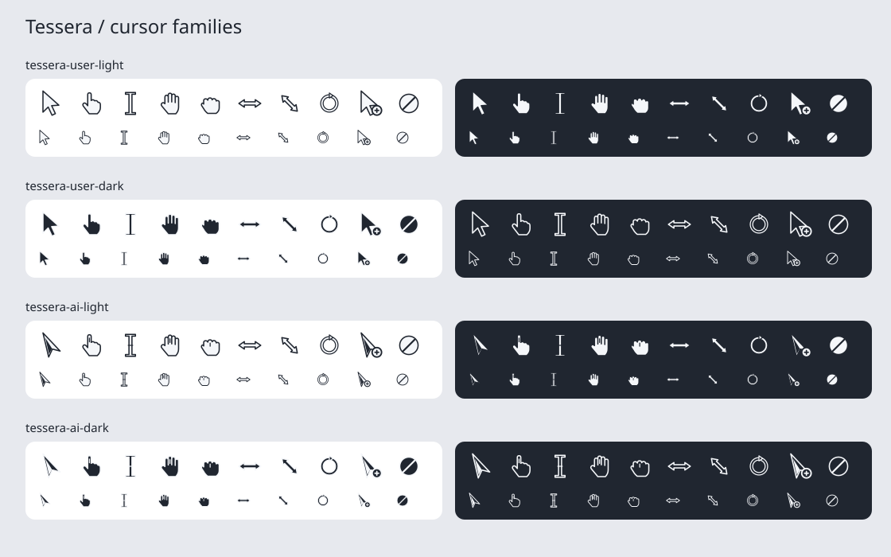

# Cursors

Status: **Adopted**.

Tessera uses one vector language with two roles and two fill polarities.
The user manipulates content; the AI feedback layer explains operations to
an observer. Shared proportions and restrained monochrome colors unite the
family, while silhouettes communicate the different roles without color.

## Visual language

| Group | Display name | Role and silhouette |
|-------|--------------|---------------------|
| `tessera-user-light` | Tessera User Light | Light fill; upright pointer with a compact shoulder and solid stem |
| `tessera-user-dark` | Tessera User Dark | Dark fill; identical user geometry and hotspots |
| `tessera-ai-light` | Tessera AI Light | Light fill; oblique fork pointer with an inset counterform and distinct AI shape language |
| `tessera-ai-dark` | Tessera AI Dark | Dark fill; identical AI geometry and anchors |

Light means `#F5F7FA` fill with `#202630` outline. Dark reverses those
colors; it does not mean “for dark backgrounds.” No gradients, shadows,
decorative glow, or per-agent hues belong in these assets. Opposing outlines
preserve visibility over arbitrary client content. User hands use continuous
rounded contours; AI shapes use distinct planar notches and open counterforms.

The user family serves the physical human seat with classical XDG semantics.
The AI family provides complete XDG shape expressiveness for Agent Interaction Domains;
a distinct silhouette unambiguously identifies the AI actor. Click operations
use minimal geometric ripple pulses, and the window mask and operation label
remain authoritative.

## Resource and runtime ownership

`scripts/prepare-tessera-cursors.py` is the geometry source of truth. All
four groups live under `assets/cursors/`, with original art covered by the
repository MIT license. Lowercase kebab-case identifiers are stable;
capitalization belongs only in display names. Generated SVGs are checked in
and embedded without a network fetch or raster asset dependency.

The two user groups are complete SVG themes: `index.theme` plus
`cursors/<name>.svg`. Standard protocol names and legacy X11 aliases remain
byte-identical within a group. The compositor embeds both and recognizes
their identifiers without a filesystem installation. Legacy `Tessera`
selects `tessera-user-light`. External SVG themes retain their search path;
unresolved shapes end at `tessera-user-light`. The `default` preference
continues to resolve the external default before this fallback.

The AI groups are complete XDG cursor themes with standard shapes and aliases,
inheriting from the corresponding user theme. The shell embeds them directly
for Agent Interaction Domain feedback; the active shape requested on the
Agent's seat is dynamically projected on the human observer's mirror.
Dark shell appearance uses AI light, and light appearance uses AI dark,
matching foreground polarity. Both variants are uploaded once and appearance
changes select between them. The existing transient click/scroll timing,
mask, labels, and capture exclusion remain in the feedback component.

User and AI pointers use a 256-unit viewBox and hotspot `(64, 28)`.
Other shapes retain their semantic hotspots across both families.
Changing polarity never changes geometry, alignment, or timing.

## Regeneration and review

Run `python3 scripts/prepare-tessera-cursors.py` to regenerate the four
groups. `--out DIR` writes the same layout into a scratch root. Generated
files are overwritten; unrelated files in the output root are preserved.
Run with `--preview docs/dev/design/foundations/cursors-preview.svg` to
refresh the contact sheet from the same generated assets.

Review at 24, 32, and 48 logical pixels on light, dark, and mixed content.
Check arrow-tip alignment, text insertion alignment, all resize directions,
button identification, and appearance changes while AI feedback is visible.
Verify that the two roles remain distinguishable in monochrome and that
polarity changes do not move the applied position. Automated checks cover
alias coverage, rasterization, and equal geometry/hotspots across polarities.

## Record lifecycle

This page is the living design and resource-ownership specification. Update
it and its contact sheet alongside implementation changes; Git preserves
previous revisions. Routine visual revisions do not require an ADR or an
archive copy. A future change to cursor resolution, ownership, or capture
boundaries must be evaluated against the architecture significance test.
The original SVG/fallback and MIT-art decisions remain recorded in
[ADR-0070](../../../adr/0070-svg-cursors-with-bundled-bibata-fallback.md) and
[ADR-0122](../../../adr/0122-original-mit-cursor-theme-replaces-bibata.md).

Return to [Assets](assets.md) or [Foundations](index.md).
